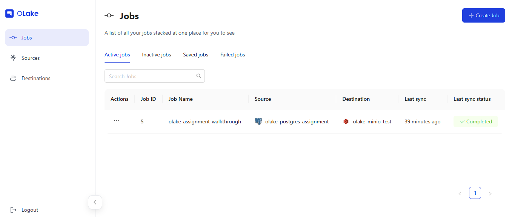

# OLake Data Sync & Query Demo

This project demonstrates syncing data from a local PostgreSQL database to MinIO (S3-compatible storage) in Parquet format using OLake, and querying the data using Apache Spark.

---

## Setup Steps

### 1. PostgreSQL

Run PostgreSQL using Docker:

```bash
docker run --name main-postgres \
  -e POSTGRES_USER=main \
  -e POSTGRES_PASSWORD=mypassword \
  -e POSTGRES_DB=main \
  -p 5431:5432 \
  -v pgdata:/var/lib/postgresql/data \
  -d postgres
```

Create a sample `orders` table and insert dummy data:

```sql
CREATE TABLE orders (
    order_id INT PRIMARY KEY,
    customer_id INT,
    product_name VARCHAR(100),
    quantity INT,
    price_per_unit DECIMAL(10, 2),
    order_date DATE
);

INSERT INTO orders (order_id, customer_id, product_name, quantity, price_per_unit, order_date) VALUES
(101, 1, 'Laptop', 1, 1200.00, '2025-08-01'),
(102, 2, 'Mouse', 2, 25.50, '2025-08-01'),
-- (insert rest of your sample data here) --
(120, 7, 'Scanner', 1, 180.50, '2025-08-17');
```

---

### 2. MinIO (Local S3 Storage)

Run MinIO with Docker Compose:

```yaml
services:
  minio:
    image: minio/minio:latest
    container_name: minio-storage
    ports:
      - "9000:9000"  # MinIO API
      - "9001:9001"  # MinIO Console
    environment:
      MINIO_ROOT_USER: minioadmin
      MINIO_ROOT_PASSWORD: minioadminpassword
    command: server /data --console-address ":9001"
    volumes:
      - ./minio_data:/data
```

Access the MinIO UI at [http://localhost:9001](http://localhost:9001) and create a bucket named `walk`.

---

### 3. Apache Spark

Build or pull Spark Docker image (example uses Bitnami Spark 3.5.1). Add necessary Hadoop AWS jars to support S3A.

Run Spark container exposing UI on port 8080.

---

### 4. OLake UI and Backend

Clone OLake UI:

```bash
git clone https://github.com/datazip-inc/olake-ui.git
cd olake-ui
docker compose up -d
```

Login at [http://localhost:8000](http://localhost:8000) with `admin` / `password`.

---

### 5. Configure OLake Sources and Destinations

- **Create Source**:  
  Connector: PostgreSQL  
  Host: `host.docker.internal`  
  Port: `5431`  
  DB: `main`  
  Username: `main`  
  Password: `mypassword`  
  SSL Mode: Disable

- **Create Destination (S3/MinIO)**:  
  Bucket: `walk`  
  Region: `ap-south-1` (or any)  
  Access Key: `minioadmin`  
  Secret Key: `minioadminpassword`  
  **Important**: Use `s3_endpoint` in backend configuration to point to local MinIO (e.g. `http://host.docker.internal:9000`). This requires a workaround via direct API calls (curl), as OLake UI currently does not fully support MinIO frontend.

---

### 6. Sync Job Creation

- Create a job selecting the created Postgres source and MinIO destination.
- Select "Sync All" streams.
- Configure job name and schedule, then create.
- Trigger manual sync from the jobs dashboard.

Your Postgres data will be converted to Parquet and uploaded to MinIO.

#### OLake Jobs Dashboard

*Screenshot showing the OLake UI with a completed sync job from PostgreSQL to MinIO*

---

### 7. Query Data Using Spark

Open a terminal in Spark container:

```bash
docker exec -it spark bash
```

Run spark-shell with necessary jars and configs:

```bash
spark-shell \
  --jars /opt/spark/jars/hadoop-aws-3.3.4.jar,/opt/spark/jars/aws-java-sdk-bundle-1.12.262.jar,/opt/spark/jars/commons-configuration2-2.8.0.jar \
  --conf spark.hadoop.fs.defaultFS=s3a://walk \
  --conf spark.hadoop.fs.s3a.endpoint=http://host.docker.internal:9000 \
  --conf spark.hadoop.fs.s3a.access.key=minioadmin \
  --conf spark.hadoop.fs.s3a.secret.key=minioadminpassword \
  --conf spark.hadoop.fs.s3a.path.style.access=true \
  --conf spark.hadoop.fs.s3a.connection.ssl.enabled=false \
  --conf spark.hadoop.fs.s3a.impl=org.apache.hadoop.fs.s3a.S3AFileSystem \
  --conf spark.hadoop.fs.s3a.aws.credentials.provider=org.apache.hadoop.fs.s3a.SimpleAWSCredentialsProvider \
  --conf spark.sql.catalogImplementation=in-memory \
  --conf spark.sql.parquet.writeLegacyFormat=false \
  --conf spark.sql.parquet.datetimeRebaseModeInRead=CORRECTED \
  --conf spark.sql.parquet.int64TimestampConversion.enabled=true \
  --conf spark.sql.legacy.parquet.nanosAsLong=true
```

#### Spark Shell Initialization

*Spark shell starting up with S3A configuration for MinIO access*

Load parquet file from MinIO (replace with your actual path):

```scala
val df = spark.read.parquet("s3a://walk/public/orders/2025-8-9_19-54-54_01K286D0QHX47BN8ZWXF7PYWR3.parquet")
df.show()
```

#### Schema Definition for JSON Parsing

*Defining the schema structure for parsing JSON data from the Parquet files*

Parse the JSON data column into schema:

```scala
import org.apache.spark.sql.functions._
import org.apache.spark.sql.types._

val schema = StructType(Seq(
  StructField("id", IntegerType, true),
  StructField("item_name", StringType, true),
  StructField("order_date", StringType, true),
  StructField("price", DoubleType, true),
  StructField("quantity", IntegerType, true)
))

val parsedDF = df.select(from_json(col("data"), schema).alias("parsed_data")).select("parsed_data.*")
parsedDF.show()
```

#### Raw Parquet Data Display

*Raw data loaded from the Parquet file showing the JSON structure in the data column*

#### Parsed and Structured Data Output

*Final parsed data showing the structured orders with proper column names and data types*

---

## Screenshots Summary

The images above demonstrate:
1. **OLake UI Dashboard**: Shows successful sync job completion from PostgreSQL to MinIO
2. **Spark Shell Initialization**: Spark 3.5.1 starting with proper S3A configuration
3. **Schema Definition**: Setting up the data structure for JSON parsing in Spark
4. **Raw Data Loading**: Displaying the raw Parquet data with JSON in the data column
5. **Final Query Results**: Parsed and structured data ready for analytics

---

## Challenges & Improvements

- OLake UI does not fully support MinIO as destination out-of-the-box; requires manual API calls with `s3_endpoint` override.  
- Documentation for local S3 endpoint support in OLake could be improved.  
- Automating MinIO bucket creation and job setup could streamline the process.  
- Spark config for S3 access needs precise setup of Hadoop AWS jars and options, which can be simplified with better container images.

---

## Summary

This demo shows a full pipeline: local Postgres → OLake sync → Parquet on MinIO → query via Spark on S3A. It provides a solid foundation for scalable data sync and analytics using open source tools.

The complete workflow demonstrates:
- Setting up PostgreSQL as a data source
- Configuring OLake for data synchronization
- Using MinIO as S3-compatible storage
- Querying synced data with Apache Spark
- Parsing JSON data structures for analytics

---
